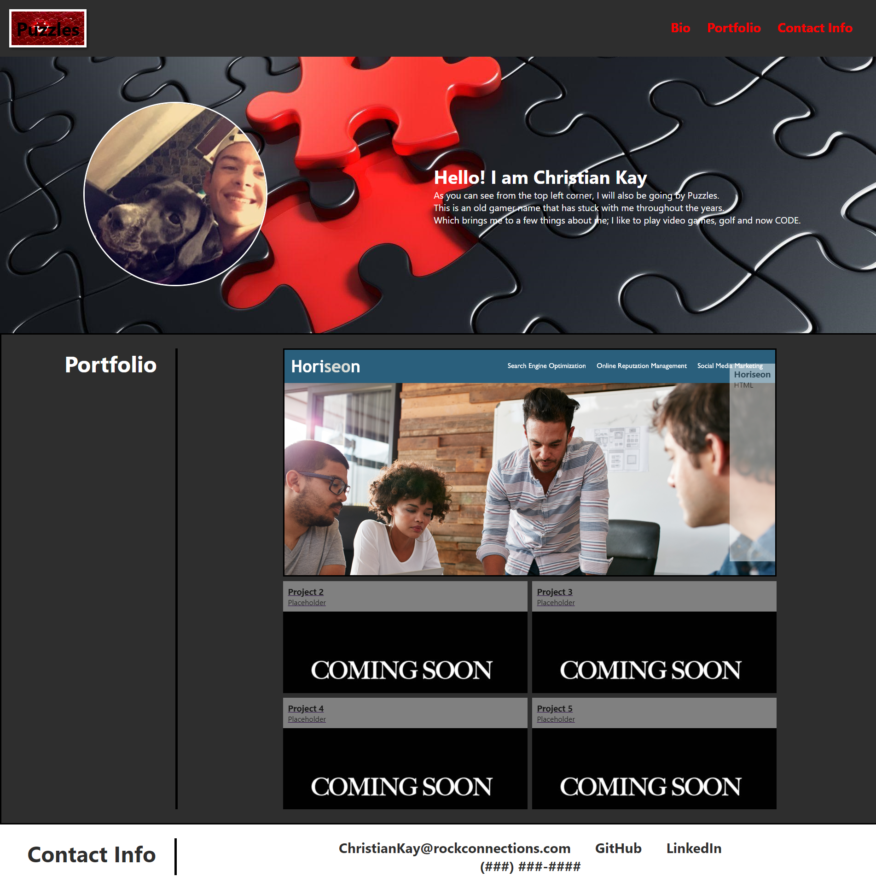

# Portfolio

This challenge I was tasked with putting together a portfolio page. 

Throughout the process of putting together this portfolio I realized there was a lot of CSS/HTML language I was not aware of and a lot of items I had to implement, but had not learned. This really helped me adapt and use what information I had on the web to fully grow my skills and come to a final product, for now. 

Overall this project was an eye opener and will be a project I hope to see grow a long with my knowledge of HTML.

## Site URL

[Portfolio Site URL](https://puzzlesx1.github.io/Portfolio/)

## Site Image

